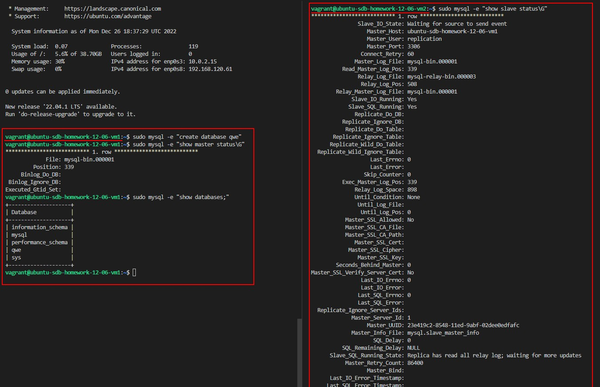
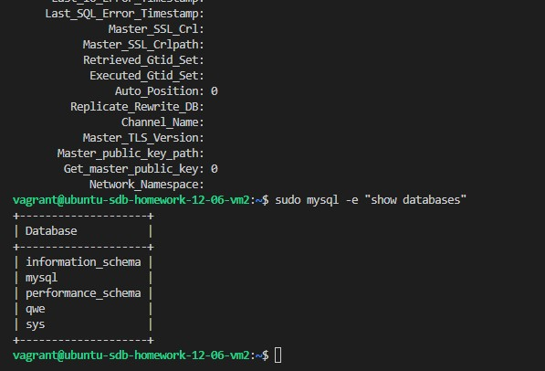

# Домашнее задание к занятию 12.6. «Репликация и масштабирование. Часть 1» - Лабазов Александр

---

### Задание 1

На лекции рассматривались режимы репликации master-slave, master-master, опишите их различия.
```
Master-slave - производится реплицирование в одностороннем порядке. Slave-сервер будет доступен только в режиме Read only

Master-master - реплицирование производится в двустороннем порядке, оба сервера доступны для записи. Есть риск возникновения коллизий.
```

---

### Задание 2

Выполните конфигурацию master-slave репликации, примером можно пользоваться из лекции.

*Приложите скриншоты конфигурации, выполнения работы: состояния и режимы работы серверов.*

В репозитории в каталоге [./vm](./vm/) Приложил Vagrant-файл и скрипты/файлы провизионирования виртуальных машин.

Результаты развёртывания:


